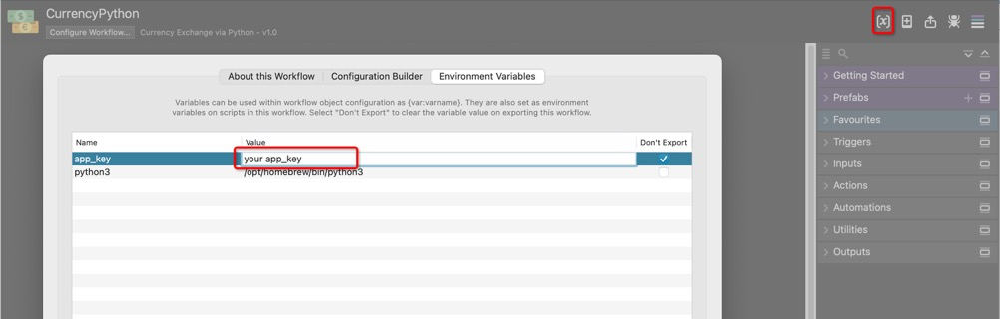
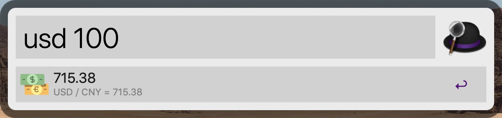
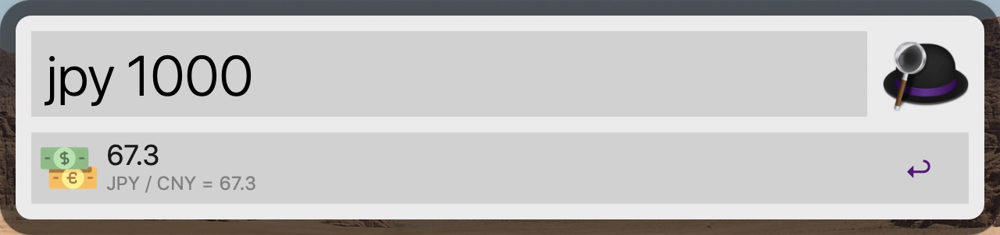
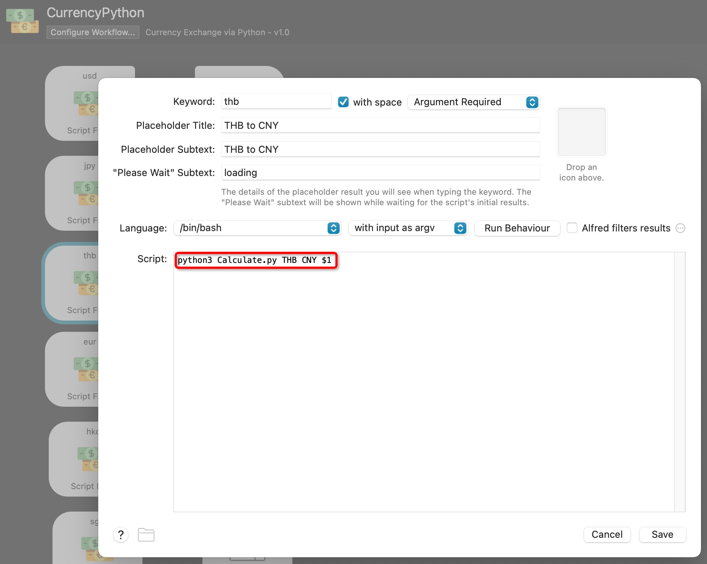

# Currency

Alfred Workflow Currency Exchange. Convert any currency to CNY.

## API

The free API is from [jisuapi.com](https://www.jisuapi.com/)

Please apply from here:
[https://www.jisuapi.com/api/exchange/](https://www.jisuapi.com/api/exchange/)

Then fill in the appkey in Alfred Workflows Environment Variables.


## Usage
```
usd 100
```



```
jpy 1000
```



Press enter than the result will copy to you clipboard.

## Customize

Here is the code in workflow editor.

```shell
python3 Calculate.py THB CNY $1
```

You can convert any currency to another by modify the Script text field, like THB to CNY.

